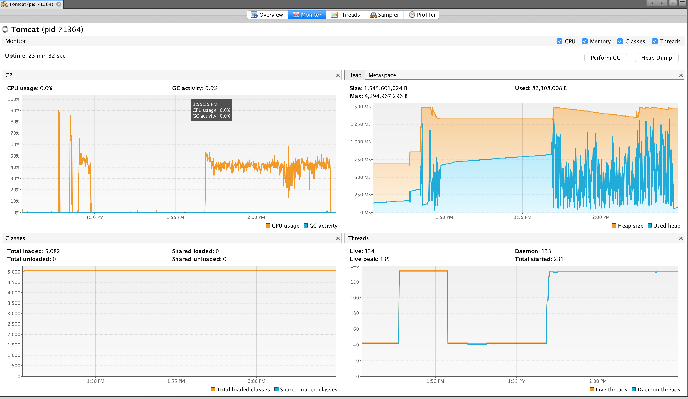

start server
-------------

```bash
[info] Loading global plugins from /Users/prayagupd/.sbt/0.13/plugins
[info] Loading project definition from /Users/prayagupd/config-management-ui/project
[info] Set current project to config-management-ui (in build file:/Users/prayagupd/config-management-ui/)

> jetty:start
[info] starting server ...
[success] Total time: 0 s, completed Apr 8, 2018 1:37:36 PM
> 2018-04-08 13:37:36.525:INFO::main: Logging initialized @179ms to org.eclipse.jetty.util.log.StdErrLog
2018-04-08 13:37:36.533:INFO:oejr.Runner:main: Runner
2018-04-08 13:37:36.742:INFO:oejs.Server:main: jetty-9.4.8.v20171121, build timestamp: 2017-11-21T13:27:37-08:00, git hash: 82b8fb23f757335bb3329d540ce37a2a2615f0a8
2018-04-08 13:37:36.941:WARN:oeja.AnnotationParser:main: Unrecognized runtime asm version, assuming 393216
2018-04-08 13:37:37.630:INFO:oeja.AnnotationConfiguration:main: Scanning elapsed time=688ms
SLF4J: Failed to load class "org.slf4j.impl.StaticLoggerBinder".
SLF4J: Defaulting to no-operation (NOP) logger implementation
SLF4J: See http://www.slf4j.org/codes.html#StaticLoggerBinder for further details.
2018-04-08 13:37:37.825:INFO:oejs.session:main: DefaultSessionIdManager workerName=node0
2018-04-08 13:37:37.832:INFO:oejs.session:main: No SessionScavenger set, using defaults
2018-04-08 13:37:37.837:INFO:oejs.session:main: Scavenging every 660000ms
2018-04-08 13:37:39.470:INFO:oejsh.ContextHandler:main: Started o.e.j.w.WebAppContext@2d6a9952{/,file:///Users/prayagupd/config-management-ui/target/webapp/,AVAILABLE}{file:///Users/prayagupd/config-management-ui/target/webapp/}
2018-04-08 13:37:39.582:INFO:oejs.AbstractConnector:main: Started ServerConnector@425631ff{HTTP/1.1,[http/1.1]}{0.0.0.0:8080}
2018-04-08 13:37:39.583:INFO:oejs.Server:main: Started @3238ms
```

```bash
$ curl localhost:8080
config management

curl localhost:8080/config
{"config":"your order has been received and will be shipped in a while."}
```

using tomcat
------------

```scala
sbt package
cp target/scala-2.12/config-management-ui_2.12-0.1.war /usr/local/apache-tomcat-8.5.12/webapps/
/usr/local/apache-tomcat-8.5.12/bin/startup.sh

curl localhost:9090/config-management-ui_2.12-0.1/config
{"config":"your order has been received and will be shipped in a while."}
```

perf
----

1M
---

```bash
ab -n 1000000 -c 100 -k 127.0.0.1:9090/config-management-ui_2.12-0.1/config
This is ApacheBench, Version 2.3 <$Revision: 1807734 $>
Copyright 1996 Adam Twiss, Zeus Technology Ltd, http://www.zeustech.net/
Licensed to The Apache Software Foundation, http://www.apache.org/

Benchmarking 127.0.0.1 (be patient)
Completed 100000 requests
Completed 200000 requests
Completed 300000 requests
Completed 400000 requests
Completed 500000 requests
Completed 600000 requests
Completed 700000 requests
Completed 800000 requests
Completed 900000 requests
Completed 1000000 requests
Finished 1000000 requests


Server Software:
Server Hostname:        127.0.0.1
Server Port:            9090

Document Path:          /config-management-ui_2.12-0.1/config
Document Length:        73 bytes

Concurrency Level:      100
Time taken for tests:   43.890 seconds
Complete requests:      1000000
Failed requests:        0
Keep-Alive requests:    990052
Total transferred:      216950260 bytes
HTML transferred:       73000000 bytes
Requests per second:    22784.40 [#/sec] (mean)
Time per request:       4.389 [ms] (mean)
Time per request:       0.044 [ms] (mean, across all concurrent requests)
Transfer rate:          4827.23 [Kbytes/sec] received

Connection Times (ms)
              min  mean[+/-sd] median   max
Connect:        0    0   0.8      0     133
Processing:     0    4   4.3      4     211
Waiting:        0    4   4.3      4     211
Total:          0    4   4.5      4     228

Percentage of the requests served within a certain time (ms)
  50%      4
  66%      4
  75%      5
  80%      5
  90%      6
  95%      7
  98%     11
  99%     14
 100%    228 (longest request)
```

10M
---

```bash
ab -n 10000000 -c 100 -k 127.0.0.1:9090/config-management-ui_2.12-0.1/config
This is ApacheBench, Version 2.3 <$Revision: 1807734 $>
Copyright 1996 Adam Twiss, Zeus Technology Ltd, http://www.zeustech.net/
Licensed to The Apache Software Foundation, http://www.apache.org/

Benchmarking 127.0.0.1 (be patient)
Completed 1000000 requests
Completed 2000000 requests
Completed 3000000 requests
Completed 4000000 requests
Completed 5000000 requests
Completed 6000000 requests
Completed 7000000 requests
Completed 8000000 requests
Completed 9000000 requests
Completed 10000000 requests
Finished 10000000 requests


Server Software:
Server Hostname:        127.0.0.1
Server Port:            9090

Document Path:          /config-management-ui_2.12-0.1/config
Document Length:        73 bytes

Concurrency Level:      100
Time taken for tests:   465.410 seconds
Complete requests:      10000000
Failed requests:        0
Keep-Alive requests:    9900054
Total transferred:      2169500270 bytes
HTML transferred:       730000000 bytes
Requests per second:    21486.45 [#/sec] (mean)
Time per request:       4.654 [ms] (mean)
Time per request:       0.047 [ms] (mean, across all concurrent requests)
Transfer rate:          4552.23 [Kbytes/sec] received

Connection Times (ms)
              min  mean[+/-sd] median   max
Connect:        0    0   1.1      0     425
Processing:     0    5   7.4      4    1039
Waiting:        0    4   7.4      4    1039
Total:          0    5   7.6      4    1043

Percentage of the requests served within a certain time (ms)
  50%      4
  66%      4
  75%      5
  80%      5
  90%      6
  95%      8
  98%     12
  99%     17
 100%   1043 (longest request)
```

